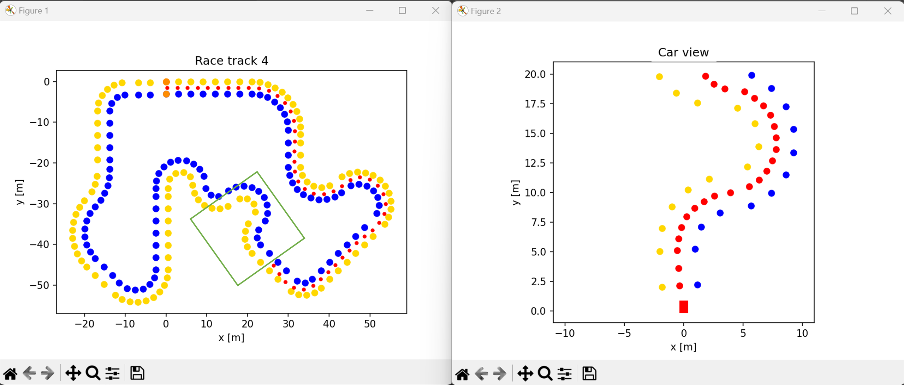

# AAU-Racing-Driverless P4-Project
 ![]

The AAU Racing team, mainly consisting of energy and mechanical engineers, proposed a project to the
Robotics department of Aalborg University which was to establish a foundation that will enable them to
compete in the driverless disciplines in the Formula Student Competitions. The purpose of this project was to create and demonstrate a proof of concept for the AAU Racing team to adhere to in their further driverless developments. In general the challenge posed by the driverless discipline all come down to the capability of recognizing and localising cones marking the drive track, as well as developing a steering algorithm to control the car based on the cone detection. This repository contains the resulting code generated by the 4th semester Robotics group 364. Videos of the developed proof of concept can be found by following this [link](https://www.youtube.com/playlist?list=PLvF0YaCHe3KkUl1-hWkZ5l_QOGys4rh2i)

## Hardware Overview
As the AAU Racing team, as of this writing, yet have to build their electric race car, the proof of concept was based on an old RC car. The car have been modified to carry a ZED Stereo Camera and a Jetson Nano computer unit, as well as others. As the solution was based on depth vision and the YOLO algorithm, the processing power required was relatively high. While still being small and power efficient the Jetson Nano could meet the processing requirement by utilising its GPU. The image below show an overview of the modified RC car used for the project.

## Software Overview
(https://img.shields.io/badge/C++-11-brightgreen.svg)   

Three approaches for detecting the cones were investigated. First traditional computer vision techniques, such as thresholding, edge detection and template matching, were set up and tested. It was quickly found that this approach was not robust enough to change in environment. Also it was not fast enough for a real-time solution. Secondly the HOG algorithm was tested together with an SVM classifier. Beside being very slow the HOG algorithm that was tested could not handle changes in cone sizes i.e. cones at different distances. This HOG/SVM code can be found in Alternatives folder. Lastly the YOLOv5 algorithm was tested and gave very promising results after initially being trained on a small dataset. After training the algorithm on the big [Fsoco-Dataset](https://www.fsoco-dataset.com/) created by the Formula Student community, the tests gave results of upwards 95% precision for finding the primary cones (yellow and blue). To run efficiently on the Jetson Nano the trained YOLOv5 model was converted to a TensorRT engine using the code by [mailrocketsystems](https://github.com/mailrocketsystems/JetsonYolov5).

The trajectory planner is based on delauney triangulation, which can draw lines between the yellow and blue cones. On these lines midpoints are placed and used as reference points for direction of the car.

To help develop a proper steering algorithm a simple 2D simulation have been set up using matplotlib. The simulation can randomly generate a realistic track and simulate the cameras field of view, do delauney triangulation and test various steering algorithms. Below an example from the simulation can be seen.

## Contributors
This project was developed by group 261 on Aalborg University, Robot Technology at 2nd semester.

<section id="sec_contributors">
<table>
  <tr> 
    <td align="center"><a target="_blank" rel="noreferrer noopener" href="https://github.com/signeskuldbol"> <b>Signe Møller-Skuldbøl</b></a> <a href="gttps://github.com/signeskuldbol" title="">👧</a></td>
    <td align="center"><a target="_blank" rel="noreferrer noopener" href="https://github.com/thor2643"> <b>Thor Iversen</b></a> <a href="gttps://github.com/thor2643" title="">👨‍🌾</a></td>
    <td align="center"><a target="_blank" rel="noreferrer noopener" href="https://github.com/silasjensen2001"> <b>Silas Jensen</b></a> <a href="gttps://github.com/silasjensen2001" title="">🤠</a></td>
  <td align="center"><a target="_blank" rel="noreferrer noopener" href="https://github.com/Magnusdar"> <b>Magnus Darø</b></a> <a href="gttps://github.com/Magnusdar" title="">🐻</a></td>
  <td align="center"><a target="_blank" rel="noreferrer noopener" href="https://github.com/TheRobotSkier"> <b>Emil Hausberger</b></a> <a href="gttps://github.com/TheRobotSkier" title="">😎</a></td>
  </tr>
</table>

